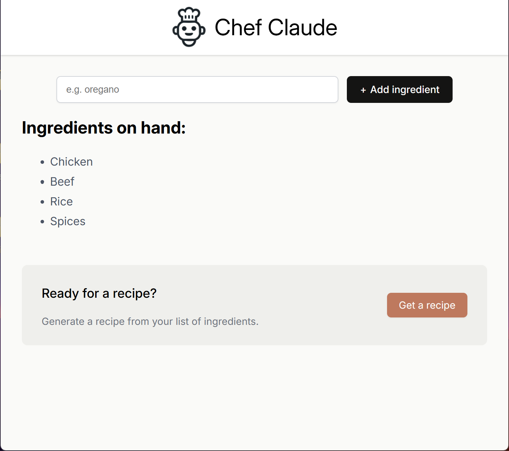

[English](README.md) | [中文](README.zh.md)

# Chef Claude

一个由 AI 驱动的食谱推荐应用。输入你手头的食材，即可获得由 Groq LLM API 生成的定制食谱。支持英文和中文。

[](./media/demo.mp4)

## ▶️ 在线演示

<a href="https://gotham-citizen.github.io/Chef-Claude/">
  
</a>

点击上方图片或[此处](https://gotham-citizen.github.io/Chef-Claude/)体验！

## 工作原理

1. 在表单中输入食材并添加到列表中。
2. 当食材达到 4 种后，点击 **生成食谱**。
3. 应用将食材发送到 Cloudflare Worker，Worker 将请求代理至 Groq API（`llama-3.3-70b-versatile`）。
4. AI 返回 Markdown 格式的食谱，渲染在页面上。

应用会自动检测浏览器语言（`en` 或 `zh`），并相应切换界面文字和 AI 回复语言。

## 技术栈

### 前端

- **React 19** — UI 组件与 Hooks
- **Vite** — 开发服务器与构建工具
- **react-markdown** — 将 AI 返回的 Markdown 渲染为 HTML
- **自定义 i18n** — 基于 React Context 的轻量翻译系统（`LanguageContext` + `i18n.js`）

### 后端 / 基础设施

- **Groq REST API** — AI 食谱生成，通过 `fetch` 直接调用 `llama-3.3-70b-versatile`（无需 SDK）
- **Cloudflare Workers** — 无服务器 API 代理（服务端保存 Groq API 密钥）
- **Wrangler** — Cloudflare Workers 命令行工具，用于本地开发与部署
- **GitHub Actions** — CI/CD 流水线，自动构建并部署到 GitHub Pages

## 快速开始

### 前置条件

- Node.js (v18+)
- Groq API 密钥（[在此申请](https://console.groq.com/keys)）

### 安装

```bash
npm install
```

在项目根目录创建 `.env` 文件：

```
VITE_WORKER_URL=https://your-worker-url.workers.dev
```

### 本地 Worker 配置

Groq API 密钥保存在 Cloudflare Worker 中，不会暴露给客户端。

1. 进入 `worker/` 目录，创建 `.dev.vars` 文件：

```
GROQ_API_KEY=your_groq_api_key_here
```

2. 本地启动 Worker：

```bash
npx wrangler dev
```

3. 在项目根目录的 `.env` 中将 `VITE_WORKER_URL` 设为 `http://localhost:8787`。

### 部署 Worker

```bash
npx wrangler deploy
```

然后将 `GROQ_API_KEY` 设为 Secret：

```bash
npx wrangler secret put GROQ_API_KEY
```

### 本地运行

```bash
npm run dev
```

访问 `http://localhost:5173`。

### 构建生产版本

```bash
npm run build
npm run preview
```

## 项目结构

```
├── index.html                  # HTML 入口
├── vite.config.js              # Vite 配置
├── eslint.config.js            # ESLint 扁平配置
├── src/
│   ├── index.jsx               # React 挂载点
│   ├── index.css               # 全局样式
│   ├── App.jsx                 # 根组件（包裹 LanguageProvider）
│   ├── ai.js                   # API 客户端（向 Worker 发起 fetch）
│   ├── LanguageContext.jsx     # 语言状态与翻译的 React Context
│   └── i18n.js                 # 翻译字典 + detectLanguage()
├── components/
│   ├── Header.jsx              # Logo 与标题
│   ├── Main.jsx                # 食材表单与状态管理
│   ├── IngredientsList.jsx     # 食材列表与"生成食谱"按钮
│   └── ClaudeRecipe.jsx        # 食谱渲染组件
├── worker/                     # Cloudflare Worker（API 代理）
│   ├── worker.js               # Worker 逻辑：CORS、验证、Groq 调用
│   ├── wrangler.toml           # Wrangler 配置
│   ├── .dev.vars               # 本地密钥（已 gitignore）
│   └── .dev.vars.example       # 本地密钥模板
├── .github/workflows/
│   └── deploy.yml              # GitHub Actions CI/CD
└── media/
    ├── chef-claude-icon.png
    ├── demo.png
    └── demo.mp4
```

## 语言支持

应用会自动检测浏览器语言设置，在英文和中文之间切换。AI 会根据匹配语言回复。

| 语言   | 检测方式                        |
| ------ | ------------------------------- |
| 英语   | `navigator.language` 以 `en` 开头 |
| 中文   | `navigator.language` 以 `zh` 开头 |

如需添加新语言，请在 `src/i18n.js` 中添加条目，并更新 `worker/worker.js` 中的 `buildSystemPrompt` / `buildUserMessage` 函数。

## 安全说明

Groq API 密钥保存在 Cloudflare Worker 服务端（通过 `wrangler secret put` 或 `.dev.vars` 设置）。客户端只知道 Worker 的 URL。CORS 配置仅允许来自开发服务器和生产环境 GitHub Pages 域名的请求。
